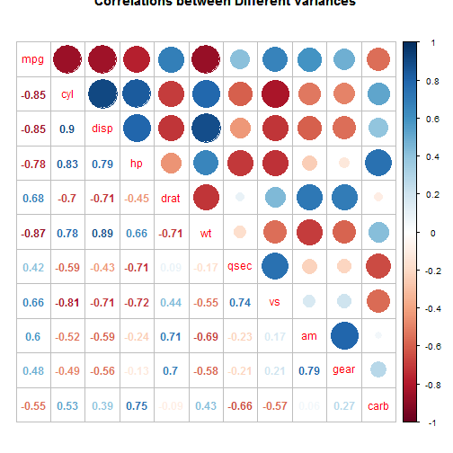
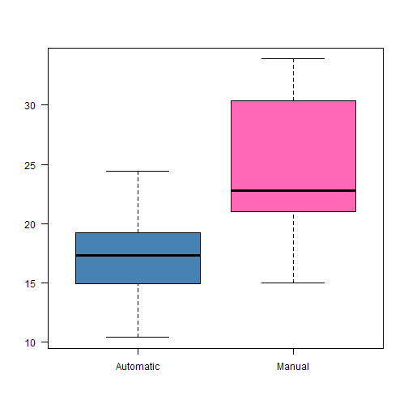
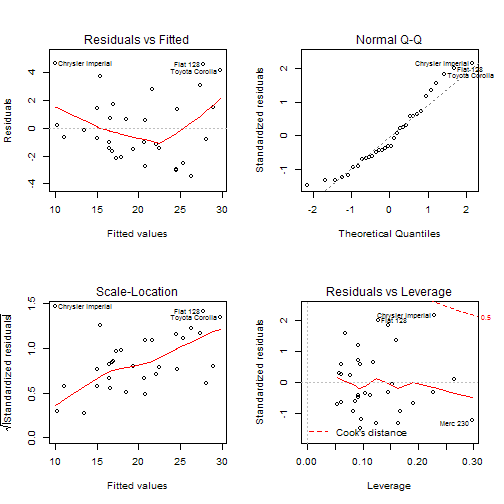

# MT is Better than AT for Fuel Efficiency
### By Marco Xu
## Exclusive Summary and Synopsis
This report tries to answer these two questions.
##### ¡°Is an automatic or manual transmission better for MPG¡± & 
##### ¡°Quantify the MPG difference between automatic and manual transmissions¡±
##### I take the mtcars data set and write up an analysis to answer their question using regression models and exploratory data analyses.

## Part1 "Is an automatic or manual transmission better for MPG¡±
We may take a glimpse of the mtcars data. First use the cor function to get the correlations between mpg and each of other variables. Also we will draw a plot Figure 1 of correlations between different variables with "corrplot.mixed".

```r
library(datasets)
library(corrplot)
```

```
## Warning: package 'corrplot' was built under R version 3.1.1
```

```r
summary(mtcars)
```

```
##       mpg            cyl            disp             hp       
##  Min.   :10.4   Min.   :4.00   Min.   : 71.1   Min.   : 52.0  
##  1st Qu.:15.4   1st Qu.:4.00   1st Qu.:120.8   1st Qu.: 96.5  
##  Median :19.2   Median :6.00   Median :196.3   Median :123.0  
##  Mean   :20.1   Mean   :6.19   Mean   :230.7   Mean   :146.7  
##  3rd Qu.:22.8   3rd Qu.:8.00   3rd Qu.:326.0   3rd Qu.:180.0  
##  Max.   :33.9   Max.   :8.00   Max.   :472.0   Max.   :335.0  
##       drat            wt            qsec            vs       
##  Min.   :2.76   Min.   :1.51   Min.   :14.5   Min.   :0.000  
##  1st Qu.:3.08   1st Qu.:2.58   1st Qu.:16.9   1st Qu.:0.000  
##  Median :3.69   Median :3.33   Median :17.7   Median :0.000  
##  Mean   :3.60   Mean   :3.22   Mean   :17.8   Mean   :0.438  
##  3rd Qu.:3.92   3rd Qu.:3.61   3rd Qu.:18.9   3rd Qu.:1.000  
##  Max.   :4.93   Max.   :5.42   Max.   :22.9   Max.   :1.000  
##        am             gear           carb     
##  Min.   :0.000   Min.   :3.00   Min.   :1.00  
##  1st Qu.:0.000   1st Qu.:3.00   1st Qu.:2.00  
##  Median :0.000   Median :4.00   Median :2.00  
##  Mean   :0.406   Mean   :3.69   Mean   :2.81  
##  3rd Qu.:1.000   3rd Qu.:4.00   3rd Qu.:4.00  
##  Max.   :1.000   Max.   :5.00   Max.   :8.00
```

Second we will draw the box plot Figure 2 of the mpg variable against the influence by factor am with "boxplot"

## Part2 Quantify the MPG difference between automatic and manual transmissions
First, we try to find some relations

```r
bartlett.test(mpg ~ am, data = mtcars)$p.value
```

```
## [1] 0.07248
```
The p-value is significantly small, thus we will draw to the conclusion that the variable am influences the mean of different cars¡¯ MPG.

```r
fit.whole <- lm(mpg ~ ., data = mtcars)
fit.optimal <- step(fit.whole, direction = 'both')
```

```r
summary(fit.optimal)
```

```
## 
## Call:
## lm(formula = mpg ~ wt + qsec + am, data = mtcars)
## 
## Residuals:
##    Min     1Q Median     3Q    Max 
## -3.481 -1.556 -0.726  1.411  4.661 
## 
## Coefficients:
##             Estimate Std. Error t value Pr(>|t|)    
## (Intercept)    9.618      6.960    1.38  0.17792    
## wt            -3.917      0.711   -5.51    7e-06 ***
## qsec           1.226      0.289    4.25  0.00022 ***
## am             2.936      1.411    2.08  0.04672 *  
## ---
## Signif. codes:  0 '***' 0.001 '**' 0.01 '*' 0.05 '.' 0.1 ' ' 1
## 
## Residual standard error: 2.46 on 28 degrees of freedom
## Multiple R-squared:  0.85,	Adjusted R-squared:  0.834 
## F-statistic: 52.7 on 3 and 28 DF,  p-value: 1.21e-11
```
Then we plot them with "plot".

This is the end of the main text
#### _______________________________________________________________________________________________________________________________


## Appendix
#### Part1 Figure1

```r
M <- cor(mtcars)
corrplot.mixed(M, lower = "number", upper = "circle", title= "Correlations between Different Variances")
```

 
#### Part1 Figure2

```r
boxplot(mpg ~ am, data = mtcars, col=c("steelblue","hotpink"),names = c("Automatic", "Manual"),las=1, font.lab=2)
```

 
#### Part2 Figure

```r
par(mfrow = c(2,2))
plot(fit.optimal)
```

 

This is the end of the appendix 
